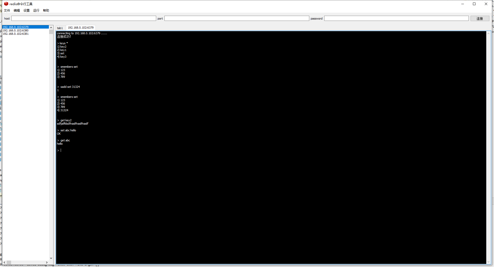

# Redis Desktop

a very powerful redis manage tool **for windows**.


## preview


# Features
* [x] manage sessions conveniently 
* [x] multi tabpages 
* [x] i18n
* [x] batch execute commands
* [ ] other charming features.....

# Install

### install from binary
download binary file from release page, just open it!

### install from source
1. first you have to install Go
2. download the source code
3. cd project directory
4. compile
```go
go build -ldflags="-H windowsgui"
```


# Thanks 
the project is powered by [walk](https://github.com/lxn/walk) and [redigo](https://github.com/gomodule/redigo)

# License
the porject is under [MIT license](LICENSE) which can be found in LICENSE file.
